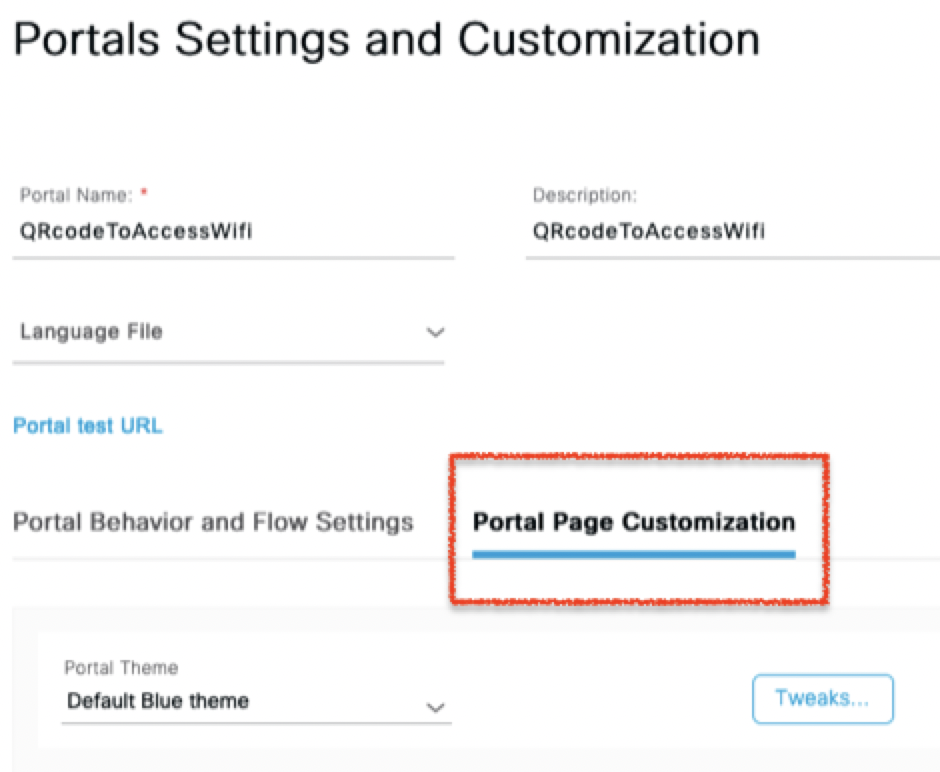

# QR Code Scanning in the ISE Guest Portal

In this repository, we show how to add a button for QR code scanning in the default ISE guest portal. The scanning logic opens a camera view in the guest portal, and uses the scanned QR code for filling in a passcode field. The passcode enables access to guest Wifi. 

In enabling this workflow, we ease the user experience in connecting to guest Wifi. Instead of having to manually fill out a network-specific passcode, users can have it be auto-filled by scanning a QR code that is, e.g., displayed in the environment where they want to use guest Wifi. Because this solution uses a camera view embedded in the guest portal itself, the user moreover does not have to rely on a third-party QR code scanner installed on their mobile device.

## Contacts
* Stien Vanderhallen (stienvan@cisco.com)
* Ramona Renner (ramrenne@cisco.com)

## Solution Components
* HTML
* JavaScript
* Default ISE guest portal (tested for ISE 3.0 and ISE 3.1)
* (an adapted variation of) ZXing: https://github.com/jbialobr/JsQRScanner/tree/master/docs/jsPretty

## Technical Overview

The following overview shows the different component interactions introduced into the default ISE guest portal by this solution, to facilitate the filling in of a passcode through scanning a QR code.

## Prerequisites

- A default ISE guest portal
- Access to the ISE dashboard
- A smartphone running any HTML5-supporting browser (Google Chrome, Firefox, Safari,...)

## Installation/Configuration

1. In the ISE dashboard, navigate to the portal management page:

2. Navigate to `Guest Access > Portals and Components`

3. Choose your guest portal

4. Navigate to `Portal Page Customization`

5. Enter the code in `main.html` in the `Optional Content 2` field, after clicking the script mode button:

*NOTE: Lines 57-66, 77-83 and 107-120 depend on the splash page's HTML code. The `div` identifier used to inject the QR code button might need to be changed accordingly.*

6. Save the portal and the top of the page, and wait until you see the following success message:

7. Use the `Portal test URL` found at the top of the page to test the portal

# PoV Workflow

The following steps describe the workflow to be followed by guest Wifi users, from the moment they land on the ISE guest portal splash page. 

1. User lands on the ISE guest portal 

2. User fills out personalized input fields

3. User clicks QR code button, points camera at QR code

4. QR code is scanned, the passcode gets autofilled in the correct field

5. The user is granted network access

### LICENSE

Provided under Cisco Sample Code License, for details see [LICENSE](LICENSE.md)

### CODE_OF_CONDUCT

Our code of conduct is available [here](CODE_OF_CONDUCT.md)

### CONTRIBUTING

See our contributing guidelines [here](CONTRIBUTING.md)

#### DISCLAIMER:
<b>Please note:</b> This script is meant for demo purposes only. All tools/ scripts in this repo are released for use "AS IS" without any warranties of any kind, including, but not limited to their installation, use, or performance. Any use of these scripts and tools is at your own risk. There is no guarantee that they have been through thorough testing in a comparable environment and we are not responsible for any damage or data loss incurred with their use.
You are responsible for reviewing and testing any scripts you run thoroughly before use in any non-testing environment.
